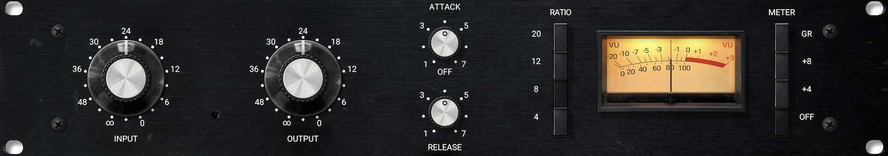
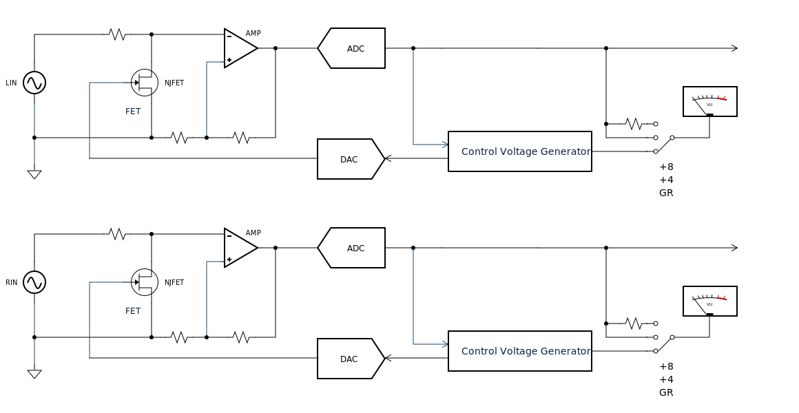
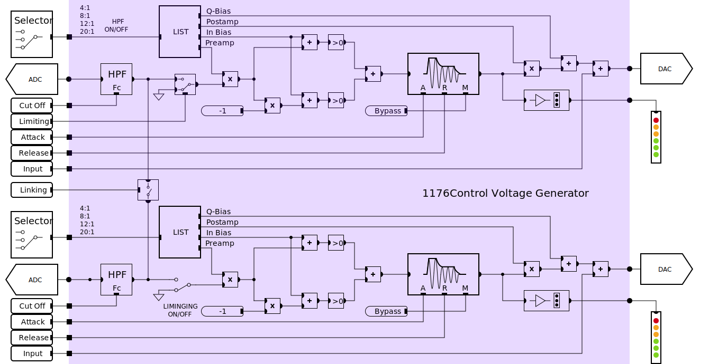

# NLIVE-24压缩实现说明
## 修订记录
|修订|日期|记录|
|---|----|--------|
|A|6/15/23|控制电压发生器增加INPUT控制,修改包络侦测模块,增加条状显示驱动模块

## 简介
NLIVE-24的压缩电路采用创新的数控模拟的方式实现，即保留了压缩效果的原音重现，又提供了最灵活的功能调节。压缩电路的核心，模拟压控放大器由纯A类分立晶体管和FET控制单元组成，压控信号则由DSP对输入的信号进行连续监测，并且实时的进行控制。

## 参数元素
下图是原型机图：

机器面板从做到右的功能排布分别是：    

1. INPUT - 控制输入信号电平的旋钮。

2. OUTPUT - 控制输出信号电平的旋钮。

3. ATTACK - 设置压缩效果的ATTACK（启动）时间，范围是20us-800us。旋钮逆时针旋转到最小位置后继续用力关闭压缩效果。此时信号仍然经过这个整个机器，但没有压缩效果。

4. RELEASE - 设置压缩效果的RELEASE（释放）时间，范围是50ms-1100ms（1.1s）。

5. RATIO - 压缩效果的压缩率通过一个四段琴键式互斥开关切换。压缩率分别是4:1，8:1，12:1和20:1。通过小心的切换按键也可实现所有按键都按下的状态，此时机器产生一个独特的压缩特性。这个操作动作叫做SLAM，是一个非常重要的操作。

6. VU表 - 压缩器带有一个具有VU特性的电平指示表。这个表的显示内容通过右侧的四档琴键开关切换，可显示增益减少dB数，信号电平VU指示。

7. METER - VU表功能选择通过一个四段琴键式互斥开关切换。GR档切换VU表指示压缩增益减小的量。+8切换VU表的针指示在0VU的位置时，输出信号为+8dBu。+4切换VU表的指针指示在0VU的位置时，输出的信号为+4dBu。切换到OFF位置时，整机关机，机器处于直通状态。

> 注意：
> 1. NLIVE-24的压缩不实现原型机的INPUT输入旋钮功能。此功能通过话放的GAIN旋钮实现。
> 2. NLIVE-24的两个压缩可独立使用，或通过LINK选项作为立体声压缩使用。

NLIVE压缩的功能框图如下：

## 效果实现
压缩效果的实现分为两个部分：

1. 压控放大器 - NLIVE-24压缩的压控放大器由纯A类的分立双极型晶体管组成的放大器和结型场效应管构成的压控单元构成。

2. 控制电压发生器 - 控制电压发生器将压缩的输出信号经过数字信号处理提取出控制电压，通过数模转换器作用于FET控制单元的输入。在发生器中可设置压缩的ATTACK、RELEASE，RATIO等效果参数。由于发生器处于数字域中，所有的压缩效果参数都可实现可编程并存储起来。

### 压控放大器

### 控制电压发生器

NLIVE的控制电压发生器由数个部分构成：
控制电压发生器用于将输入信号转化成FET控制元素的控制电压，它由上面一组模块构成。

RATIO选择开关用来选择参数设置的切换。RATIO开关选择4组参数设置，所以Q-Bias
,Postmap, In Bias和Preamp四个参数有4组参数相对应。

包络跟随模块包含效果的ATTACK和RELEASE两个参数的调节。它不受RATIO参数切换的影响而变化参数，ATTACK的范围是20uS-10ms，RELEASE的范围是50ms-1.1s的。
Postamp和最后的Q-Bias用于适配不同FET控制元件的电气特性。由于每个FET场效应管的控制区不完全一致，所以需要这部分模块针对每个机器在出厂前调试好机器。

HPF - AD输入信号进入一阶高通滤波器，高通滤波器的截止频率为20-200Hz可调或者直通。
前置放大 - 前置放大器对信号进行放大，放大倍数根据RATIO设定的位置不同而不同，RATIO位置：4:1，8:1，12:1，20:1，SLAM。
In Bias - 将Preamp的输出和Preamp经过反相后的输出分别加入In Bias值，In Bias是一个常数，每个RATIO设置下不同的值，RATIO位置分为4档：4:1，8:1，12:1，20:1。
整流 - 对两路信号进行取正值处理，然后相加。
Attack/Release参数 - 这两个参数控制包络跟随的状态。
Postamp - 产生的包络控制信号和Postamp参数相乘进行放大或缩小的运算。此参数不受RATIO切换影响。此参数暂时用不着，全部设置为1。
Q Bias — 设定控制FET导通电压信号的偏置值。此参数不受RATIO切换影响。由于每个机器的FET具有离散性，产品出厂前需要对此参数进行校准。

## 效果指示与校准

信号指示
压缩效果带有一个电平指示表，表的机械特性符合VU表标准。通过切换METER琴键开关，指示表提供三种指示：

GR - GR（增益减少量）指示压缩效果产生的增益减少dB值。
+4 - +4档指示当VU表的指针处于0VU位置时，输出的信号电平为+4dBu。
+8 - +8档指示当VU表的指针处于0VU位置时，输出信号电平为+8dBu。

（此处需扩充电表显示算法。）

## 压缩器校准

同时按住STEREO，LOOPBACK和OUT3/4上电，机器进入校准模式，所有内部音量控制此时处于旁路或设置到最大位置状态。MIX旋钮旋转到关闭输入1/2的信号。
连接OUT1/2的输出到LINE1/2的输入，从计算机或内部生成-20dBFs的1kHz信号从OUT1/2输出。调节GAIN旋钮使LINE1/2的信号达到-12dBFs。
设定好参考电平之后，用dsp生成一组不同幅值的1kHz信号，幅值范围从-40dBFs到-9dBFs。测试输入的电平值，并画出输入/输出图，线条应该是1条斜度为1的斜线。
将输入信号设定到-30dBFs，打开comp功能，设置jfet完全截止，测量压缩电路的增益图，并计算出放大器的增益值。
调节Q Bias值，使jfet微导通，输出信号比输入信号少1dB。
FET偏置设置 - 话放输入端连接1kHz 100mv输入信号，话放的gain旋钮设置在最小位置，压缩效果的RATIO设置在20:1位置。将控制电压发生器的输入端置零（将ATTACK旋钮设置在OFF位置），调节输出偏置模块的常数（常数范围使DA输出-2.8Vto0），观察AD输入的信号不断增大直到不再增大为止。然后反相调节偏置模块的常数，使AD输入的信号减小1dB。

-10dB衰减点设置 - 此比例放大器设置压缩在-10dB衰减位置时，FET的工作点。比例放大器的增益范围为（-0.5 - +0.5）。

前置放大器增益设置 - 前置放大器的增益用于控制压缩曲线的斜度，在不同的RATIO下具有不同的值：
	
输入偏置常数设置 - 输入偏置用于控制压缩的门限，在不同的RATIO下具有不同的值：

### 校准程序的问题

- 校准模式下，通道2一下就进入了调好的状态。

### 1176LN样机测试数据

- 测试样机第二级放大器的固定增益是25dB。测试方法是用信号加到机器的平衡输入口，在output输出电位器的热端引出非平衡信号测量第二级放大器前的增益，另外在output平衡输出端口连接测量仪器获得机器总的增益，两个增益相减得到第二级放大器的固定增益。输出电位器的位置放到最大位置，attack电位器处于关闭状态。

- 测试样机output电位器的线型。把电位器开到中间位置时，输出信号减小了25dB(0.056)，将所有第二级放大器的增益全部衰减掉了。output电位器用的并不是电路手册里F修订的100k电位器，用的是一个250k电位器，还在中心抽头和对地位置放置了一个68k的电阻。

- 把output电位器放到36（机器上的丝印刻度，25%位置）时，相比最大输出（10.8dBu）衰减了36dB（-25.2dBu)。

- 把output电位器放到12位置（机器上的丝印刻度，75%位置）时，相比最大输出（10.8dBu）衰减了-16.8dB（-5.97dBu）。

- 测试第一级放大器固定增益时，首先将INPUT电位器放置到最大位置，测量输入变压器次级连接270欧姆和27k欧姆电阻接点处电平，测得结果-6.0dB。然后将INPUT电位器放置到中间位置，测量相同位置，测得增益输出-20.0dB。放到最小位置测得增益-40.0dB。放到36位置时测得增益-32.8dB。放到12位置时，测得增益-12.0dB。
